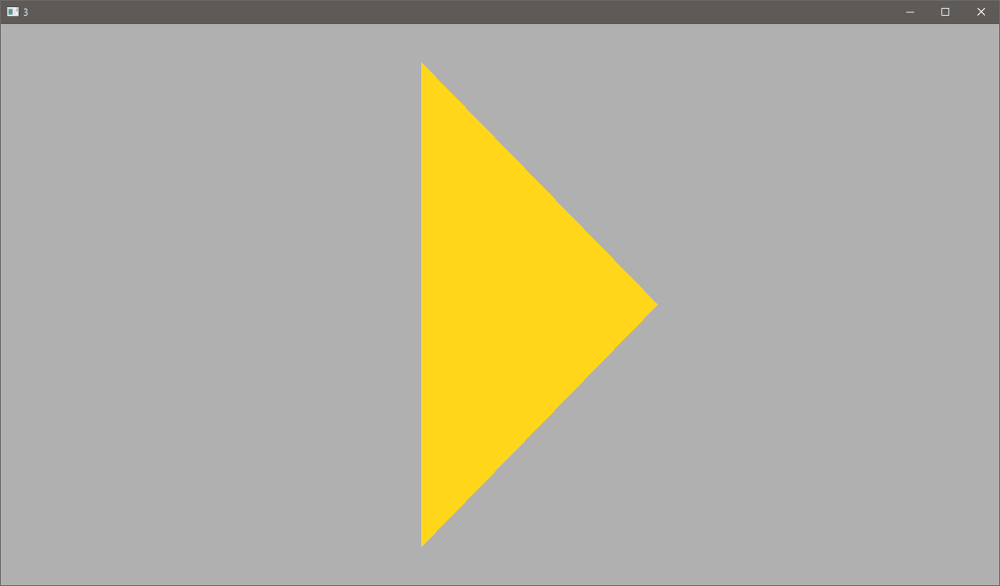

# Lista 1

## 1. Modifique a janela do mundo (window/ortho) para os limites: xmin=-10, xmax=10, ymin=-10, ymax=10.

[Fonte](src/um.cpp)

---

## 2. Agora modifique para: xmin=0, xmax=800, ymin=600, ymax=0.

[Fonte](src/dois.cpp)

---

## 3. Utilizando a câmera 2D do exercício anterior, desenhe algo na tela. O que acontece quando posicionamos os objetos? Por que é útil essa configuração?

Se utilizarmos as coordenadas normalizadas, as usadas até então, com a nova câmera, os objetos desparecem por estarem numa escala muito menor do que a nova escala.

Essa configuração é útil para nós podermos definir a escala que desejamos utilizar. Facilita desenhar, por exemplo, pixels numa escala de um para um.

[Fonte](src/tres.cpp)

---

## 4. Modifique o viewport para desenhar a cena apenas no seguinte quadrante da janela da aplicação:

[Fonte](src/quatro.cpp)

---

## 5. Agora, desenhe a mesma cena nos 4 quadrantes.

[Fonte](src/cinco.cpp)

---